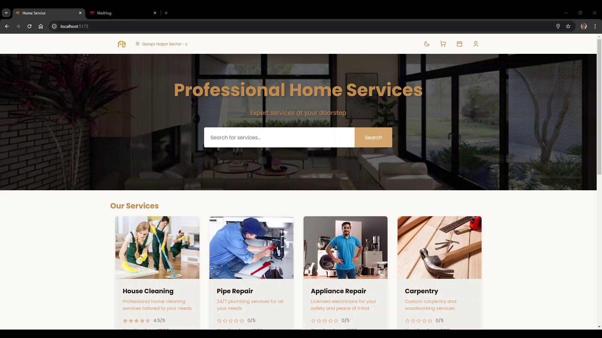
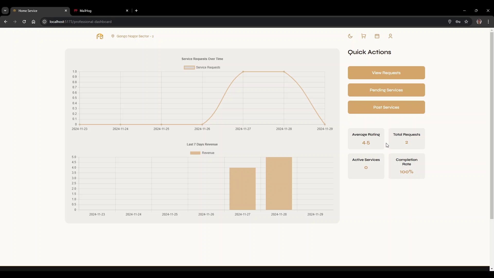

<div align="center">

# Home Service Application

[](https://www.python.org/downloads/)


</div>

## 🏆 Recognition
Awarded "Best Course Project" certificate for Modern Application Development II

## 📝 Description
A comprehensive home services platform that connects customers with professional service providers. The application facilitates seamless booking and management of household services like plumbing, electrical work, cleaning, etc.

### Key Features
- Multi-user platform (Admin, Service Professionals, Customers)
- Real-time service booking and management
- Professional verification system
- Rating and review system
- Service tracking and monitoring
- Responsive design for both desktop and mobile
- Advanced search and filtering capabilities
- Secure authentication and authorization

## 🛠️ Tech Stack

### Frontend
- Vue.js 3
- Vite
- Vuex for state management
- Chart.js for analytics
- Axios for API communication
- Vue Router

### Backend
- Flask (Python)
- SQLite for database
- Redis for caching
- Celery for background tasks
- JWT for authentication
- Flask-SQLAlchemy

### Tools & Utilities
- Git for version control
- Docker for containerization
- RESTful API architecture

## 💻 Installation & Setup

### Prerequisites
- Docker and Docker Compose
- Git

### Quick Start with Docker
1. **Clone repository**
```bash
git clone https://github.com/yash4agr/household-service.git
cd household-service
```
2. Start the application stack
```bash
docker compose up -d
```
This will start all services:
- Frontend: http://localhost:5173
- Backend API: http://localhost:5000
- MailHog UI: http://localhost:8025
- Redis: localhost:6379

3. View logs (optional)
```bash 
# View all logs
docker compose logs -f

# View specific service logs
docker compose logs -f backend
docker compose logs -f frontend
```

4. Stop the application
```bash 
docker compose down
```

### Manual Setup (Alternative)

If you prefer to run the services without Docker, you can follow these steps:

#### Prerequisites
- Python 3.9+
- Node.js 16+
- Redis Server
- SQLite3

#### Backend Setup
```bash
# Navigate to backend directory
cd backend

# Create and activate virtual environment
python -m venv venv
source venv/bin/activate # For Unix
venv\Scripts\activate # For Windows

# Install dependencies
pip install -r requirements.txt

# Set up environment variables
cp .env.example .env

# Run the server
python app.py
```

#### Frontend Setup
```bash
# Navigate to frontend directory
cd frontend

# Install dependencies
npm install

# Run development server
npm run dev
```

#### Redis & Celery Setup
```bash
# Start Redis server
redis-server

# Start Celery worker
celery -A app.celery worker --loglevel=info

# Start Celery beat for scheduled tasks
celery -A app.celery beat --loglevel=info
```

### Services Overview

The application consists of several services:

| Service | Description | Port |
|---------|-------------|------|
| Frontend | Vue.js web application | 5173 |
| Backend | Flask API server | 5000 |
| Redis | Caching and message broker | 6379 |
| Celery Worker | Background task processor | - |
| Celery Beat | Scheduled task scheduler | - |
| MailHog | Email testing service | 1025, 8025 |

## ⚙️ Environment Configuration

### Backend Environment Variables (.env)
Create a `.env` file in the `backend` directory with the following configuration:
```env
# Database
DATABASE_URL=sqlite:///database/hsa.sqlite3

# JWT Configuration
JWT_SECRET_KEY=your-secure-secret-key
JWT_ACCESS_MINUTES=15
JWT_REFRESH_DAYS=30

# Redis Configuration
REDIS_HOST=redis
REDIS_PORT=6379
REDIS_DB=1
REDIS_CACHE_DB=1

# Celery Configuration
CELERY_BROKER_URL=redis://redis:6379/2
CELERY_RESULT_BACKEND=redis://redis:6379/3

# Export Configuration
EXPORT_FOLDER=/database/export_files

# API Keys
OLA_API_KEY=your-api-key
```

### Frontend Environment Variables (.env)
Create a `.env` file in the `frontend` directory:
```env
VITE_BACKEND_URL=http://localhost:5000
VITE_GOOGLE_CLIENT_ID=your-google-client-id
```

### Environment Files Setup

1. For Docker deployment:
```bash
# Backend
cp backend/.env.example backend/.env

# Frontend
cp frontend/.env.example frontend/.env
```

2. For local development:
- Modify the Redis host to `localhost` instead of `redis`
- Update any other configuration values as needed

### Important Notes

1. **Security**: 
   - Never commit `.env` files to version control
   - Use strong, unique values for security keys
   - Keep API keys confidential

2. **Docker vs Local**:
   - Docker setup uses service names as hostnames (e.g., `redis`)
   - Local setup uses `localhost` or `127.0.0.1`

3. **Required Variables**:
   - JWT configuration is required for authentication
   - Redis configuration is needed for caching and Celery
   - Database URL must point to a valid SQLite file location

4. **Optional Variables**:
   - Google Client ID (if using Google authentication)
   - API keys for third-party services

### Environment Variables Reference

#### Backend Variables

| Variable | Description | Default | Required |
|----------|-------------|---------|----------|
| `DATABASE_URL` | SQLite database URL | `sqlite:///database/hsa.sqlite3` | Yes |
| `JWT_SECRET_KEY` | Secret key for JWT tokens | - | Yes |
| `JWT_ACCESS_MINUTES` | JWT access token expiry | 15 | Yes |
| `JWT_REFRESH_DAYS` | JWT refresh token expiry | 30 | Yes |
| `REDIS_HOST` | Redis server hostname | redis | Yes |
| `REDIS_PORT` | Redis server port | 6379 | Yes |
| `REDIS_DB` | Redis database number | 1 | Yes |
| `REDIS_CACHE_DB` | Redis cache database number | 1 | Yes |
| `EXPORT_FOLDER` | Path for exported files | /database/export_files | Yes |

#### Frontend Variables

| Variable | Description | Required |
|----------|-------------|----------|
| `VITE_BACKEND_URL` | Backend API URL | Yes |
| `VITE_GOOGLE_CLIENT_ID` | Google OAuth client ID | No |

### Troubleshooting Environment Issues

1. **Redis Connection Issues**:
```bash
# Check if Redis is running
redis-cli ping

# Verify Redis connection in Docker
docker compose exec backend python -c "import redis; redis.Redis(host='redis').ping()"
```

2. **JWT Token Issues**:
- Ensure `JWT_SECRET_KEY` is set and consistent
- Check token expiration times are appropriate

3. **Database Issues**:
- Verify the database file exists
- Check file permissions
- Ensure the path is correct for your environment

## 📱 Screenshots



## 🤝 Contributing
Contributions, issues, and feature requests are welcome! Feel free to check [issues page](link-to-issues).

## 📄 License
This project is licensed under the MIT License - see the [LICENSE](LICENSE) file for details.

## 👥 Team
- [Yash Agrawal](https://github.com/yash4agr) - Full Stack Developer

## 🙏 Acknowledgments
- Modern Application Development II Course Instructors
    - [Thejesh GN](https://thejeshgn.com/)
    - [Prof. Nitin Chandrachoodan](https://chandrachoodan.gitlab.io/)
